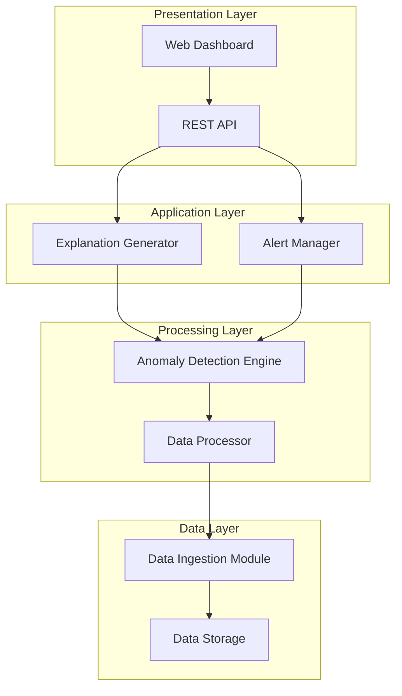

# Design Document: AnomalyLens

## Overview

AnomalyLens is designed as a lightweight, explainable AI system that processes institutional data to detect early warning signals through anomaly detection. The system follows a modular architecture with clear separation between data ingestion, anomaly detection, explanation generation, and user interface components.

The design prioritizes explainability over complex AI models, using statistical methods and lightweight machine learning approaches that can provide clear, human-readable explanations. The system operates on uploaded datasets rather than real-time streams, making it suitable for hackathon development constraints while maintaining practical utility.

Key design principles:
- **Explainability First**: Every detected anomaly comes with clear explanations
- **Lightweight Processing**: Statistical methods over heavy deep learning models
- **Modular Architecture**: Independent components for maintainability
- **User-Centric Interface**: Designed for non-technical institutional users

## Architecture

The system follows a layered architecture with four main components:



**Layer Responsibilities:**
- **Presentation Layer**: User interface and API endpoints
- **Application Layer**: Business logic for explanations and alert management
- **Processing Layer**: Core anomaly detection and data processing algorithms
- **Data Layer**: Data ingestion, validation, and temporary storage

## Components and Interfaces

### Data Ingestion Module (DIM)

**Purpose**: Handles file uploads, validation, and initial data processing.

**Key Methods**:
- `parseCSV(file: File) -> DataSet`: Parses CSV files and validates structure
- `parseExcel(file: File) -> DataSet`: Extracts data from Excel worksheets
- `validateData(dataset: DataSet) -> ValidationResult`: Ensures data quality and format
- `categorizeColumns(dataset: DataSet) -> ColumnTypes`: Identifies numerical vs text columns

**Input**: CSV/Excel files up to 10MB
**Output**: Structured DataSet objects with categorized columns

### Data Processor (DP)

**Purpose**: Prepares data for anomaly detection through cleaning and feature extraction.

**Key Methods**:
- `cleanTimeSeriesData(data: TimeSeries) -> TimeSeries`: Handles missing values and outliers
- `extractTextFeatures(text: TextData) -> TextFeatures`: Creates keyword frequency vectors
- `normalizeData(data: DataSet) -> NormalizedDataSet`: Scales numerical data appropriately
- `createTimeWindows(data: TimeSeries, windowSize: int) -> WindowedData`: Segments data for analysis

### Anomaly Detection Engine (ADE)

**Purpose**: Core component implementing lightweight anomaly detection algorithms.

**Time Series Anomaly Detection**:
- **Z-Score Method**: Identifies points exceeding 3 standard deviations from mean
- **Moving Average Deviation**: Detects significant deviations from rolling averages
- **Percentile-Based Detection**: Uses 95th/5th percentiles as thresholds
- **Seasonal Decomposition**: Separates trend, seasonal, and residual components

**Text Anomaly Detection**:
- **Keyword Frequency Analysis**: Tracks changes in term frequency over time
- **Topic Drift Detection**: Uses TF-IDF vectors to identify theme shifts
- **Category Distribution Changes**: Monitors complaint category proportions
- **Sentiment Shift Detection**: Tracks changes in positive/negative sentiment ratios

**Key Methods**:
- `detectTimeSeriesAnomalies(data: TimeSeries) -> AnomalyList`: Identifies numerical anomalies
- `detectTextAnomalies(data: TextData) -> AnomalyList`: Identifies text pattern changes
- `calculateAnomalyScore(point: DataPoint, context: Context) -> float`: Quantifies anomaly severity
- `determineTimeWindow(anomaly: Anomaly) -> TimeWindow`: Identifies anomaly duration

### Explanation Generator (EG)

**Purpose**: Creates human-readable explanations for detected anomalies.

**Explanation Templates**:
- **Spike Detection**: "A {magnitude}% increase in {metric} was detected between {start_time} and {end_time}, which is {deviation} times higher than the typical range."
- **Drop Detection**: "A {magnitude}% decrease in {metric} occurred during {time_window}, falling {deviation} standard deviations below normal levels."
- **Keyword Drift**: "The frequency of '{keyword}' increased by {percentage}% in recent {time_period}, suggesting a shift in {category} patterns."
- **Category Change**: "Complaints in '{category}' category increased from {old_percentage}% to {new_percentage}% of total complaints."

**Key Methods**:
- `generateExplanation(anomaly: Anomaly) -> Explanation`: Creates human-readable text
- `calculateMagnitude(anomaly: Anomaly) -> float`: Quantifies change magnitude
- `identifyAffectedRegion(anomaly: Anomaly) -> Region`: Determines data subset affected
- `prioritizeBySeverity(anomalies: AnomalyList) -> PrioritizedList`: Orders by importance

### Alert Manager (AM)

**Purpose**: Manages alert lifecycle, filtering, and organization.

**Key Methods**:
- `createAlert(anomaly: Anomaly, explanation: Explanation) -> Alert`: Combines detection with explanation
- `filterBySeverity(alerts: AlertList, level: SeverityLevel) -> AlertList`: Filters by importance
- `filterBySource(alerts: AlertList, source: DataSource) -> AlertList`: Filters by data origin
- `organizeByTimestamp(alerts: AlertList) -> SortedAlertList`: Chronological ordering

### Web Dashboard (UI)

**Purpose**: Provides intuitive interface for non-technical users.

**Key Features**:
- **File Upload Interface**: Drag-and-drop for CSV/Excel files
- **Data Overview**: Summary statistics and data quality indicators
- **Anomaly Visualization**: Interactive charts highlighting detected anomalies
- **Alert Panel**: Organized list of alerts with filtering options
- **Explanation Display**: Clear, jargon-free anomaly explanations
- **Export Functionality**: Download reports and visualizations

**Key Methods**:
- `renderTimeSeriesChart(data: TimeSeries, anomalies: AnomalyList) -> Chart`: Creates interactive plots
- `displayAlerts(alerts: AlertList) -> AlertPanel`: Shows organized alert list
- `applyFilters(criteria: FilterCriteria) -> FilteredView`: Updates display based on filters
- `exportReport(alerts: AlertList, format: ExportFormat) -> File`: Generates downloadable reports

## Data Models

### Core Data Structures

```typescript
interface DataSet {
  id: string;
  filename: string;
  uploadTimestamp: Date;
  columns: Column[];
  rows: DataRow[];
  metadata: DataMetadata;
}

interface Column {
  name: string;
  type: ColumnType; // NUMERICAL, TEXT, DATETIME
  statistics?: ColumnStatistics;
}

interface DataRow {
  index: number;
  values: Map<string, any>;
  timestamp?: Date;
}

interface TimeSeries {
  datasetId: string;
  columnName: string;
  dataPoints: TimeSeriesPoint[];
  statistics: TimeSeriesStatistics;
}

interface TimeSeriesPoint {
  timestamp: Date;
  value: number;
  isAnomaly: boolean;
  anomalyScore?: number;
}

interface TextData {
  datasetId: string;
  columnName: string;
  documents: TextDocument[];
  features: TextFeatures;
}

interface TextDocument {
  id: string;
  content: string;
  timestamp: Date;
  category?: string;
  keywords: string[];
}

interface Anomaly {
  id: string;
  type: AnomalyType; // SPIKE, DROP, KEYWORD_DRIFT, CATEGORY_SHIFT
  severity: SeverityLevel; // LOW, MEDIUM, HIGH
  dataSource: string;
  timeWindow: TimeWindow;
  affectedRegion: DataRegion;
  score: number;
  metadata: AnomalyMetadata;
}

interface Explanation {
  anomalyId: string;
  title: string;
  description: string;
  whatChanged: string;
  whereChanged: string;
  whenChanged: TimeWindow;
  magnitude: number;
  context: ExplanationContext;
}

interface Alert {
  id: string;
  anomaly: Anomaly;
  explanation: Explanation;
  timestamp: Date;
  status: AlertStatus; // NEW, VIEWED, DISMISSED
  priority: number;
}
```

### Statistical Models

```typescript
interface TimeSeriesStatistics {
  mean: number;
  standardDeviation: number;
  median: number;
  percentiles: Map<number, number>; // 5th, 25th, 75th, 95th
  trend: TrendDirection;
  seasonality: SeasonalityInfo;
}

interface TextFeatures {
  vocabulary: Set<string>;
  termFrequencies: Map<string, number>;
  tfidfVectors: Map<string, number[]>;
  categories: Map<string, number>;
  sentimentScores: SentimentDistribution;
}

interface AnomalyDetectionParameters {
  zScoreThreshold: number; // Default: 3.0
  movingAverageWindow: number; // Default: 10
  percentileThresholds: [number, number]; // Default: [5, 95]
  textSimilarityThreshold: number; // Default: 0.8
  minimumAnomalyDuration: number; // Default: 1
}
```

## Correctness Properties

*A property is a characteristic or behavior that should hold true across all valid executions of a system—essentially, a formal statement about what the system should do. Properties serve as the bridge between human-readable specifications and machine-verifiable correctness guarantees.*

Based on the prework analysis and property reflection, the following properties ensure AnomalyLens operates correctly across all valid inputs and scenarios:

### Property 1: File Parsing Completeness
*For any* valid CSV or Excel file uploaded to the system, the Data_Ingestion_Module should successfully parse all data and correctly categorize each column as numerical, text, or datetime.
**Validates: Requirements 1.1, 1.2, 1.3**

### Property 2: Error Handling Consistency
*For any* invalid or corrupted file uploaded to the system, the Data_Ingestion_Module should return descriptive error messages without crashing or corrupting system state.
**Validates: Requirements 1.4**

### Property 3: Data Storage Integrity
*For any* successfully parsed dataset, the stored data should be retrievable and identical to the original parsed content.
**Validates: Requirements 1.5**

### Property 4: Time Series Anomaly Detection Accuracy
*For any* time series data with artificially injected spikes or drops of known magnitude, the Anomaly_Detection_Engine should detect these anomalies and correctly calculate their deviation magnitude and time window.
**Validates: Requirements 2.1, 2.2, 2.3, 2.4**

### Property 5: Text Anomaly Detection Completeness
*For any* text dataset with known category shifts or keyword drift patterns, the Anomaly_Detection_Engine should detect these changes and correctly identify the driving keywords or categories.
**Validates: Requirements 3.1, 3.2, 3.3, 3.4**

### Property 6: Multi-language Text Processing
*For any* text data in English or Hindi, the Anomaly_Detection_Engine should process the content and detect anomalies without language-specific errors.
**Validates: Requirements 3.5**

### Property 7: Explanation Generation Completeness
*For any* detected anomaly, the Explanation_Generator should create an explanation that includes what changed, where it changed, and the time window of the change.
**Validates: Requirements 4.1, 4.2, 4.3**

### Property 8: Alert Prioritization Consistency
*For any* set of multiple anomalies with different severity levels, the Explanation_Generator should order them consistently by severity (high, medium, low).
**Validates: Requirements 4.5**

### Property 9: Visual Anomaly Highlighting
*For any* chart displaying time series data with detected anomalies, the Dashboard should visually distinguish anomalous points from normal data points.
**Validates: Requirements 5.3**

### Property 10: Alert Organization Consistency
*For any* collection of alerts, the Dashboard should organize them by severity level and maintain chronological order within each severity group.
**Validates: Requirements 5.4**

### Property 11: Filter Functionality Correctness
*For any* filter criteria applied to alerts (severity, source, category), the Dashboard should return only alerts matching those criteria while preserving chronological order.
**Validates: Requirements 6.1, 6.2, 6.3**

### Property 12: Visualization Update Consistency
*For any* filter applied to the dataset, all visualizations should update to reflect only the filtered data subset.
**Validates: Requirements 6.5**

### Property 13: Data Encryption at Rest
*For any* uploaded dataset stored temporarily, the data should be encrypted using appropriate encryption algorithms.
**Validates: Requirements 7.2**

### Property 14: Data Deletion Completeness
*For any* dataset marked for deletion, all associated data should be completely removed from storage and no longer retrievable.
**Validates: Requirements 7.3**

### Property 15: Privacy Protection in Explanations
*For any* generated explanation, the text should not contain specific individual record details or personally identifiable information.
**Validates: Requirements 7.4**

### Property 16: Audit Logging Completeness
*For any* data processing operation performed by the system, an appropriate audit log entry should be created with sufficient detail for debugging.
**Validates: Requirements 7.5, 9.4**

### Property 17: System Extensibility Preservation
*For any* new functionality added to the Data_Ingestion_Module, all existing parsing and validation tests should continue to pass.
**Validates: Requirements 9.3**

## Error Handling

The system implements comprehensive error handling across all components:

### Data Ingestion Errors
- **File Format Errors**: Invalid CSV/Excel structure, unsupported file types
- **Data Quality Errors**: Missing required columns, inconsistent data types
- **Size Limit Errors**: Files exceeding 10MB limit
- **Encoding Errors**: Unsupported character encodings

### Processing Errors
- **Insufficient Data**: Time series with fewer than minimum required points
- **Algorithm Failures**: Statistical calculation errors, convergence failures
- **Memory Errors**: Dataset too large for available memory
- **Timeout Errors**: Processing exceeding time limits

### User Interface Errors
- **Network Errors**: Upload failures, API communication issues
- **Rendering Errors**: Chart generation failures, visualization errors
- **Browser Compatibility**: Unsupported browser features

### Error Response Format
All errors follow a consistent structure:
```json
{
  "error": {
    "code": "ERROR_CODE",
    "message": "Human-readable error description",
    "details": "Technical details for debugging",
    "timestamp": "2024-01-23T10:30:00Z",
    "requestId": "unique-request-identifier"
  }
}
```

## Testing Strategy

AnomalyLens employs a dual testing approach combining unit tests and property-based tests to ensure comprehensive coverage and correctness validation.

### Unit Testing Approach
Unit tests focus on specific examples, edge cases, and integration points:
- **File parsing examples**: Test with sample CSV/Excel files
- **Algorithm validation**: Test anomaly detection with known datasets
- **UI component testing**: Test individual dashboard components
- **Error condition testing**: Test specific error scenarios
- **API endpoint testing**: Test REST API responses

### Property-Based Testing Approach
Property-based tests validate universal properties across randomized inputs:
- **Minimum 100 iterations** per property test to ensure statistical confidence
- **Randomized data generation** for comprehensive input coverage
- **Property validation** against the 17 correctness properties defined above
- **Automated test case generation** to discover edge cases

### Testing Framework Configuration
- **Property Testing Library**: QuickCheck (Haskell), Hypothesis (Python), or fast-check (JavaScript)
- **Test Tagging**: Each property test tagged with format: **Feature: anomaly-lens, Property {number}: {property_text}**
- **Coverage Requirements**: Minimum 90% code coverage for core components
- **Performance Testing**: Separate benchmarks for processing time requirements

### Test Data Strategy
- **Synthetic Data Generation**: Create controlled datasets with known anomalies
- **Real Data Samples**: Use anonymized institutional data samples
- **Edge Case Data**: Empty files, single-row datasets, extreme values
- **Multi-language Data**: English and Hindi text samples for language testing

The testing strategy ensures that both specific examples work correctly (unit tests) and that universal properties hold across all possible inputs (property tests), providing comprehensive validation of system correctness.